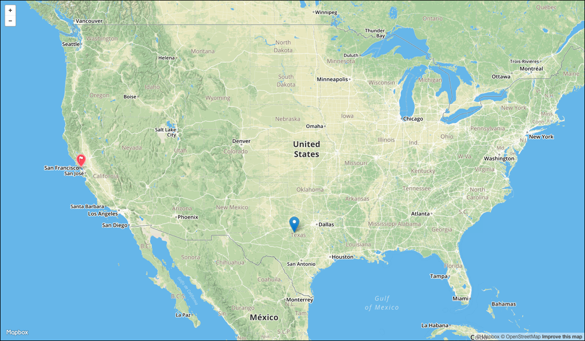
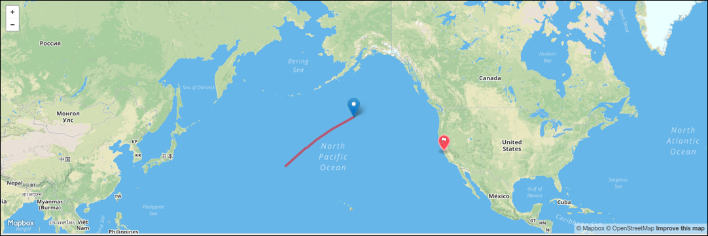
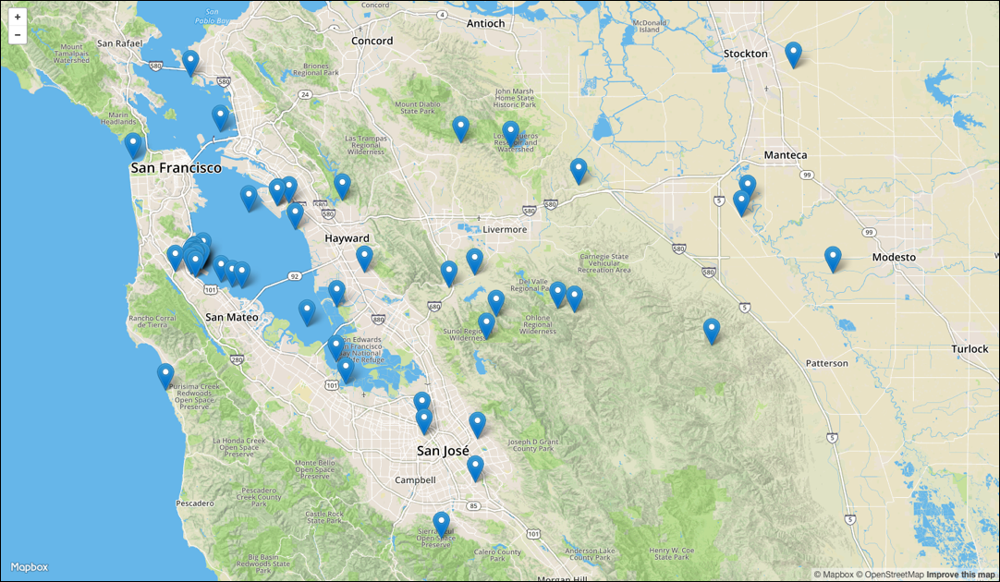
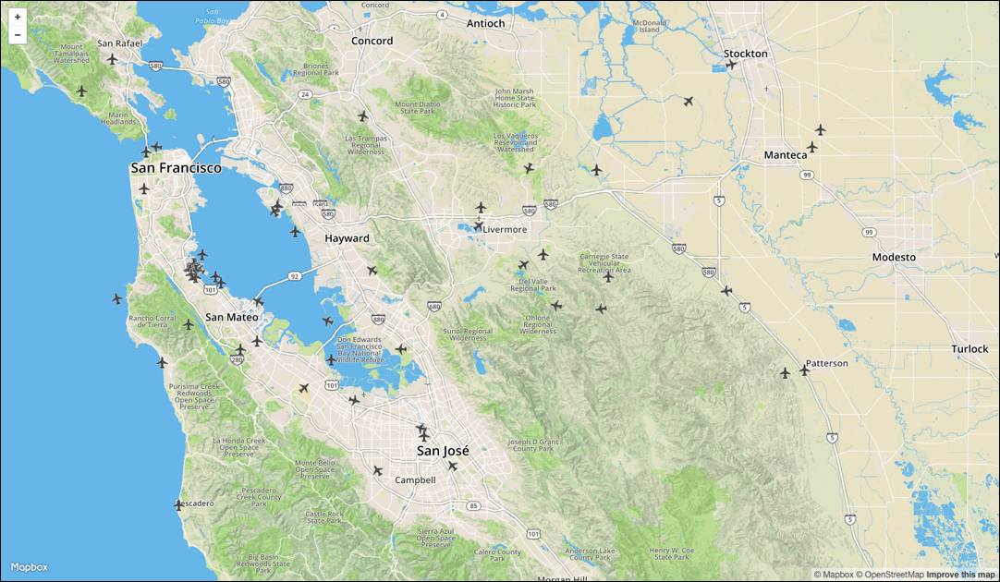

# Lesson 3: Tracking with Maps

In this lesson instead of more charts we are going to build a map. Yes, a real geographical
map.

Start with basic HTML page with a PubNub connection like this:

``` html
    <!DOCTYPE html>
    <html lang="en">
    <head>
        <meta charset="UTF-8">
        <title>Exercise 1</title>
        <script type="text/javascript" src="//pubnub.github.io/eon/v/eon/0.0.9/eon.js"></script>
        <link type="text/css" rel="stylesheet" href="//pubnub.github.io/eon/v/eon/0.0.9/eon.css" />
        <style type="text/css">
            html, body { margin: 0; }
            #map {
                position: absolute;
                top:0;
                bottom:0;
                left:0;
                right:0;
            }

        </style>
    </head>
    <body>
    <div id="map"></div>
    <script type="text/javascript">
        var pubnub = PUBNUB.init({
            ssl           : true,  // <- enable TLS Tunneling over TCP
            publish_key   : "demo",
            subscribe_key : "demo"
        });
    </script>
    </body>
    </html>

```

Now let's create our own stream containing a set of four geographical points in latitude / longitude pairs.


``` javascript

    var points = [
        {"latlng":[31,-99]},
        {"latlng":[31,-100]},
        {"latlng":[32,-100]},
        {"latlng":[32,-99]}
    ];
    var count = -1;
    setInterval(function(){
        count = count + 1;
        if(count >= points.length) count = 0;
        console.log("publishing", points[count])
        PUBNUB.publish({
            channel:  'eon-map',
            message: [ points[count] ]
        });
    }, 3000);
```

The code above will publish a message once every three seconds to a channel called 'eon-map'. Notice
that the message is just a list of points. It doesn't have the 'eon' sub-property like we did with charts.

Now we can build a map. Instead of using `eon.chart` like before, call `eon.map`.

``` javascript
    var map = eon.map({
      id: 'map',
      mb_token: 'pk.eyJ1IjoiaWFuamVubmluZ3MiLCJhIjoiZExwb0p5WSJ9.XLi48h-NOyJOCJuu1-h-Jg',
      mb_id: 'ianjennings.l896mh2e',
      channel: 'eon-map',
      pubnub: pubnub,
      rotate: true,
    })
```

## Unique Channel Names

We just created a new problem. Since everyone in this workshop will be publishing data
at the same time. A single PubNub channel can handle this. There won't be any locking or performance
problems, however you may get the same points over and over or out of order.  To fix this you
must make up your own unique channel name to publish to, like `map-channel-my-name-goes-here`.

That's it.  Now your webpage should look like this:




Note that we added two special fields to the config: `mb_token` and `mb_id`. These are not PubNub keys, but
rather MapBox tokens. For this workshop you can use these tokens created by our map master Ian, but for your own projects you'll need to sign up for a free account [at MapBox](https://www.mapbox.com).


## Following a marker


This page shows the marker tracing in a square pattern in the middle of Texas. If you zoom in you'll see it more clearly.
Notice how the marker doesn't just jump from one point to another, but animates smoothly between the current
and new datapoint. However, the itself map doesn't actually move when the marker moves. In a proper application
we'd want the map to pan in case the new datapoint is offscreen.

Add a `message` callback to the map. Every time a data point comes in this
function will be called. To recenter the map call `map.setView` with the new
data point and a zoom level. For this prototype `8` is a reasonable zoom level.

``` javascript
    var map = eon.map({
        id: 'map',
        mb_token: 'pk.eyJ1IjoiaWFuamVubmluZ3MiLCJhIjoiZExwb0p5WSJ9.XLi48h-NOyJOCJuu1-h-Jg',
        mb_id: 'ianjennings.l896mh2e',
        channel: 'eon-map',
        pubnub: pubnub,
        rotate: true,
        message: function (data) {
            map.setView(data[0].latlng, 8); //8 is the zoom level
        },
    });
```

Now the map will automatically follow the marker around when new data points arrive.

## A Real Data Stream

So far we have been using fake data produced by our own webpage. Now let's switch to
a real data stream.  Anmol Agrawol just wrote a new blog on [how to get
the current location](https://www.pubnub.com/blog/2016-02-19-plotting-iss-real-time-mapbox/) of
the International Space Station (ISS).  He set up a stream
that we can subscribe to with a different key.  To see this change the PubNub key
and the channel to

``` javascript
var pubnub = PUBNUB.init({
    ssl           : true,  // <- enable TLS Tunneling over TCP
    subscribe_key : 'sub-c-cc7e207a-d418-11e5-bcee-0619f8945a4f',
});

...

var map = eon.map({
    id: 'map',
    mb_token: 'pk.eyJ1IjoiaWFuamVubmluZ3MiLCJhIjoiZExwb0p5WSJ9.XLi48h-NOyJOCJuu1-h-Jg',
    mb_id: 'ianjennings.l896mh2e',
    channel : "iss-pubnub",
    pubnub: pubnub,
});
```

Also remove the `publish_key` since we won't be using it anymore.

This stream is in a slightly different format than EON is expecting,
so again we need a `transform` function.

``` javascript
//iss
transform: function(m) {
  return {
    iss: {
      latlng: [m.latitude, m.longitude],
      data: m
    }
  }
},

```

Also add change the `message` callback to center the map.

```javascript
message: function (data) {
  map.setView(data.iss.latlng,3);
}
```


## Drawing Lines

While it's cool to see the current position of the ISS we
can't really get a sense of its orbit without seeing the path
it takes. Let's add a line on top of the map to show the
orbital path.

First we need to create a polyline object before the map is created,
since we will reference it later.


``` javascript
    var polyline = L.polyline([], {color:'red', fillColor:'red'});
    var map = eon.map({
        id: 'map',
    ...
  })
```

After the map is created we can add the polyline to it


``` javascript
    var map = eon.map({
    ... create the map
    });
    polyline.addTo(map);
```

This code will add the line to the map but it doesn't
have any points in it so we can't see it.  Every time a new point comes
in we need to call `polyline.addLatLng()`. We can do this in the message callback.

``` javascript
    message: function (data) {
      map.setView(data.iss.latlng,3);
      polyline.addLatLng(data.iss.latlng);
    },
```

Now the map will update the line every time a new point comes in.




## Real Flight Data


Now we are going to switch to a realtime stream of planes at SFO. This stream has multiple planes
at once, so we need to change a few things.

First let's turn off following since we don't want to follow multiple markers at once. Let's also
turn off polyline as well

 ```javascript
    message: function (data) {
      //map.setView(data.iss.latlng,3);
      //polyline.addLatLng(data.iss.latlng);
    },
```


Now let's switch to some real flight data.

Using data from *url*.  We are only using flights going in and out of
the San Francisco International Airport (SFO), but *company* has
flight data available for lots of airports.

Planes are published to a single stream, though not every plane updates on every tick.  EON handles
this for us so we don't need to worry about syncing up markers to data points at different rates.

To access the real flight data, change the publish and subscribe keys to the ones for the new stream.

``` javascript
var pubnub = PUBNUB.init({
    ssl           : true,  // <- enable TLS Tunneling over TCP
    subscribe_key: 'sub-c-bd9ab0d6-6e02-11e5-8d3b-0619f8945a4f',
});
```

And change the channel to `sfo-flight-data` and update the `map_id`.

``` javascript
var map = eon.map({
    id: 'map',
    mb_token: 'pk.eyJ1IjoiaWFuamVubmluZ3MiLCJhIjoiZExwb0p5WSJ9.XLi48h-NOyJOCJuu1-h-Jg',
    mb_id: 'ianjennings.lec06po7',
    channel: 'sfo-flight-data',
    ...
  });
```

Now the map should look like this:



## Customizing the Planes

Now let's create a custom marker type.  MapBox has a standard marker
which we can make *look* different, but it doesn't know how to *rotate*
to follow the path of the plane.  Fortunately we can easily extend
the standard marker like this:

``` javascript
    L.RotatedMarker = L.Marker.extend({
        options: { angle: 0 },
        _setPos: function(pos) {
            L.Marker.prototype._setPos.call(this, pos);
            this._icon.style[L.DomUtil.TRANSFORM] += ' rotate(' + this.options.angle + 'deg)';
        }
    });
```

The definition above creates a new marker type `L.RotatedMarker` which
knows how to rotate the underlying icon when `setPos()` is called.

Now we need to create a new marker for every data point. EON will call
a `marker` callback to do this, so let's add our own callback which
creates a new marker with an airplane icon.

``` javascript
        rotate: true,
        marker: function (latlng, data) {
            var marker = new L.RotatedMarker(latlng, {
                icon: L.icon({
                    iconUrl: 'https://www.mapbox.com/maki/renders/airport-24@2x.png',
                    iconSize: [24, 24]
                })
            });
            return marker;
        }
```

Also note that the code above sets the `rotate` flag to true. This tells
EON to calculate the bearing (direction) of each plane and
the `setPos()` function on the marker whenever the bearing changes.

Now our map looks like this:




# Next Steps

That's all there is to building complex mapping visualizations
of realtime data.  While we used flight data here, you could also
overlay hundreds of other data points for things like temperature
sensors, wind speed, or any other sensor outputs.

You can find the source to both the ISS and SFO demos in [the Github
repo](https://github.com/pubnub/eon-workshop) for this project under `lesson3`.

For this workshop you used demo keys. To create your on charts and maps, or
to publish data, you can setup [your free PubNub account](https://www.pubnub.com) in just a few minutes.
